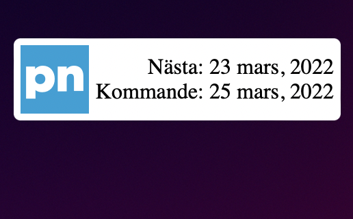

# PostNord widget for Übersicht (Swedish)
Shows mail delivery dates by [PostNord](https://www.postnord.se/vara-verktyg/sok-utdelningsdag) using a swedish zip code. Refreshes every 12 hours.  
Get [Übersicht](http://tracesof.net/uebersicht/) from [http://tracesof.net/uebersicht/](http://tracesof.net/uebersicht/)

## Preview

## Config
Change `zipCode` to match yours. You can change where the widget is positioned by changing `top` and `left`.